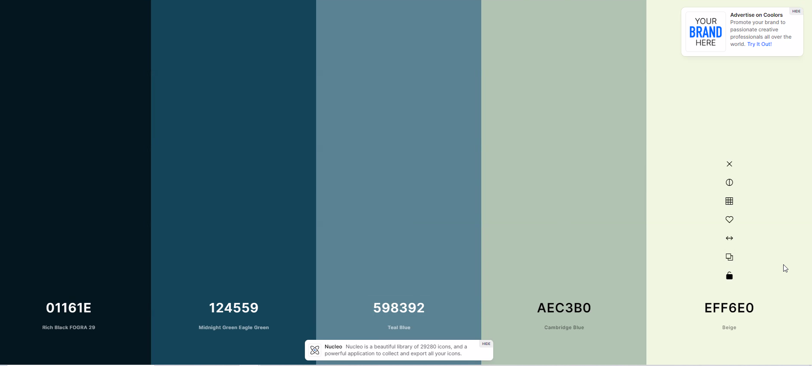

# Blue Banana Team
Objetivo:

Cubrir la necesidad de presencia en redes de una nueva empresa de desarrollo web. 

Se diseña y crea página web de presentación de la empresa BBT, sus servicios y sus empleados.

Desarrolladores:
  - Gustavo Ardaya
  - Alejandro Caballero
  - Pere Josep Juan

Tecnología: desarrollado en HTML y CSS

Enlaces de trabajo >>

Figma: https://www.figma.com/file/i0pjbPg6yxudrYfQu8LkzS/Untitled?node-id=0%3A1&t=30RW6oyEIjeB1BNZ-0

Trello: https://trello.com/b/87Ae2qNQ/proyecto-git

URL página: https://gustavoardaya.github.io/ProyectoGit/

Metodología >>
  - Brainstorming, plasmando las ideas en Trello: 
    - Pensar nombre 
    - paleta de colores: se usó la pág. Coolors.com / colores relacionados con el nombre y con tonalidad  / colores menos agresivos 
         
    - Diseñar Figma 
    - Características y apartados  

  - Funcionalidad: 
    - Aprender el uso de Flexbox para crear y disponer botones que nos llevaran a las secciones de equipo o que lanzaran el cliente de correo para contactarnos.

    - Realizar contenedores y modificarlos para ajustar la presentación de imágenes.
      - Border-Radius
    
    - Dar diferentes estilos al texto:
      - Font styles:
        - background: linear-gradient
        - shadow
        - stroke
        - otros ...
    
    - Generar enlaces relativos y absolutos y aprender a vincularlos a imágenes y a otras páginas propias.

    - Uso de "margin" y "padding" para acomodar elementos en los contenedores.

    - Creación y uso de secciones con y sin semántica propia ("div", "section").

    - Creación y uso de "class" e "id" para organización y diseño dentro de CSS. Cómo combinar en CSS varias "class" para añadir especificidades.

